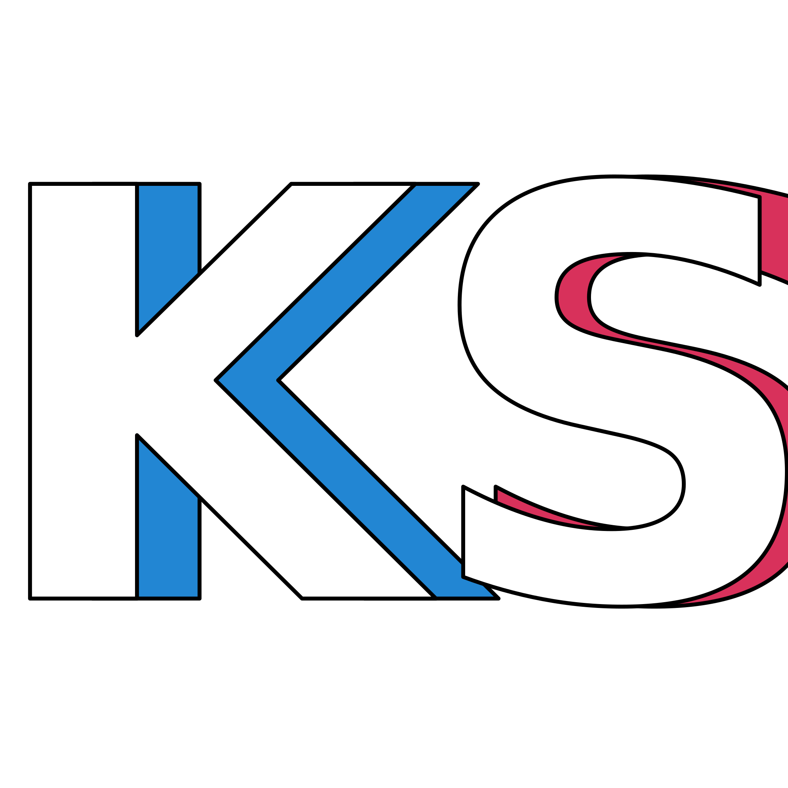

<div id="top"></div>
<!--
*** Thanks for checking out the Best-README-Template. If you have a suggestion
*** that would make this better, please fork the repo and create a pull request
*** or simply open an issue with the tag "enhancement".
*** Don't forget to give the project a star!
*** Thanks again! Now go create something AMAZING! :D
-->


<!-- PROJECT SHIELDS -->
<!--
*** I'm using markdown "reference style" links for readability.
*** Reference links are enclosed in brackets [ ] instead of parentheses ( ).
*** See the bottom of this document for the declaration of the reference variables
*** for contributors-url, forks-url, etc. This is an optional, concise syntax you may use.
*** https://www.markdownguide.org/basic-syntax/#reference-style-links
-->
[![Contributors][contributors-shield]][contributors-url]
[![Forks][forks-shield]][forks-url]
[![Stargazers][stars-shield]][stars-url]
[![Issues][issues-shield]][issues-url]
[![MIT License][license-shield]][license-url]
[![LinkedIn][linkedin-shield]][linkedin-url]


<!-- PROJECT LOGO -->
<br />
<div align="center">
  <a href="https://github.com/KennyStanley">
    
  </a>

<h3 align="center">Next.js Project Template</h3>

  <p align="center">
    A simple Next.js application with TypeScript, Tailwind CSS and testing suite enabled
    <br />
    <a href="https://github.com/KennyStanley/nextjs-project"><strong>Explore the docs »</strong></a>
    <br />
    <br />
    <!-- <a href="https://github.com/KennyStanley/nextjs-project">View Demo</a>
    · -->
    <a href="https://github.com/KennyStanley/nextjs-project/issues">Report Bug</a>
    ·
    <a href="https://github.com/KennyStanley/nextjs-project/issues">Request Feature</a>
  </p>
</div>


<!-- TABLE OF CONTENTS -->
<details>
  <summary>Table of Contents</summary>
  <ol>
    <li>
      <a href="#about-the-project">About The Project</a>
      <ul>
        <li><a href="#built-with">Built With</a></li>
      </ul>
    </li>
    <li>
      <a href="#getting-started">Getting Started</a>
      <ul>
        <li><a href="#prerequisites">Prerequisites</a></li>
        <li><a href="#installation">Installation</a></li>
      </ul>
    </li>
    <li><a href="#usage">Usage</a></li>
    <!-- <li><a href="#roadmap">Roadmap</a></li> -->
    <li><a href="#contributing">Contributing</a></li>
    <li><a href="#license">License</a></li>
    <li><a href="#contact">Contact</a></li>
    <li><a href="#acknowledgments">Acknowledgments</a></li>
  </ol>
</details>


<!-- ABOUT THE PROJECT -->
## About The Project

[![Next.js Project Screenshot][product-screenshot]](https://github.com/KennyStanley/nextjs-project)

A starting boilerplate for a TS Next.js project with batteries included. Tailwind CSS in JIT mode for styling, Jest and React Testing Library working with path aliases and node-mock-http for API route testing.

<p align="right">(<a href="#top">back to top</a>)</p>


### Built With

* [Next.js](https://nextjs.org/)
* [React.js](https://reactjs.org/)
* [Typescript](https://www.typescriptlang.org/)
* [TailwindCSS](https://tailwindcss.com/)
* [Jest](https://jestjs.io/)
* [React Testing Library](https://testing-library.com/docs/react-testing-library/intro/)

<p align="right">(<a href="#top">back to top</a>)</p>


<!-- GETTING STARTED -->
## Getting Started

To get a local copy up and running follow these simple example steps.

### Prerequisites

Install yarn (or replace yarn commands with the npm equivalent)
* yarn
  ```sh
  npm install --global yarn
  ```

### Installation

1. Clone the repo
   ```sh
   git clone https://github.com/KennyStanley/nextjs-project.git
   ```
3. Install dependencies
   ```sh
   yarn
   ```
<p align="right">(<a href="#top">back to top</a>)</p>


<!-- USAGE EXAMPLES -->
## Usage

* To run dev environment:
    ```sh
    yarn dev 
    ```
* To run prod environment:
    ```sh
    yarn build
    yarn start
    ```
* To run tests:
    ```sh
    yarn test
    ```

<!-- _For more examples, please refer to the [Documentation](https://example.com)_ -->

<p align="right">(<a href="#top">back to top</a>)</p>


<!-- ROADMAP -->
<!-- ## Roadmap
- [] Feature 1
- [] Feature 2
- [] Feature 3
    - [] Nested Feature
See the [open issues](https://github.com/KennyStanley/nextjs-project/issues) for a full list of proposed features (and known issues).
<p align="right">(<a href="#top">back to top</a>)</p> -->


<!-- CONTRIBUTING -->
## Contributing

Contributions are what make the open source community such an amazing place to learn, inspire, and create. Any contributions you make are **greatly appreciated**.

If you have a suggestion that would make this better, please fork the repo and create a pull request. You can also simply open an issue with the tag "enhancement".
Don't forget to give the project a star! Thanks again!

1. Fork the Project
2. Create your Feature Branch (`git checkout -b feature/AmazingFeature`)
3. Commit your Changes (`git commit -m 'Add some AmazingFeature'`)
4. Push to the Branch (`git push origin feature/AmazingFeature`)
5. Open a Pull Request

<p align="right">(<a href="#top">back to top</a>)</p>


<!-- LICENSE -->
## License

Distributed under the MIT License. See `LICENSE` for more information.

<p align="right">(<a href="#top">back to top</a>)</p>


<!-- CONTACT -->
## Contact

Kenny Stanley - [@KennyStanleyJr](https://www.instagram.com/kennystanleyjr/) - kennystanley615@gmail.com

Project Link: [https://github.com/KennyStanley/nextjs-project](https://github.com/KennyStanley/nextjs-project)

<p align="right">(<a href="#top">back to top</a>)</p>


<!-- ACKNOWLEDGMENTS -->
## Acknowledgments

* [Setting up a Next.js Application with Typescript, JIT Tailwind CSS and Jest/react-testing-library](https://blog.antoniolofiego.com/setting-up-a-nextjs-application-with-typescript-jit-tailwind-css-and-jestreact-testing-library)
* [Batteries-Included-Next.js](https://github.com/antoniolofiego/Batteries-Included-Next.js)
<!-- * []() -->

<p align="right">(<a href="#top">back to top</a>)</p>


<!-- MARKDOWN LINKS & IMAGES -->
<!-- https://www.markdownguide.org/basic-syntax/#reference-style-links -->
[contributors-shield]: https://img.shields.io/github/contributors/KennyStanley/nextjs-project.svg?style=for-the-badge
[contributors-url]: https://github.com/KennyStanley/nextjs-project/graphs/contributors
[forks-shield]: https://img.shields.io/github/forks/KennyStanley/nextjs-project.svg?style=for-the-badge
[forks-url]: https://github.com/KennyStanley/nextjs-project/network/members
[stars-shield]: https://img.shields.io/github/stars/KennyStanley/nextjs-project.svg?style=for-the-badge
[stars-url]: https://github.com/KennyStanley/nextjs-project/stargazers
[issues-shield]: https://img.shields.io/github/issues/KennyStanley/nextjs-project.svg?style=for-the-badge
[issues-url]: https://github.com/KennyStanley/nextjs-project/issues
[license-shield]: https://img.shields.io/github/license/KennyStanley/nextjs-project.svg?style=for-the-badge
[license-url]: https://github.com/KennyStanley/nextjs-project/blob/main/LICENSE
[linkedin-shield]: https://img.shields.io/badge/-LinkedIn-black.svg?style=for-the-badge&logo=linkedin&colorB=555
[linkedin-url]: https://www.linkedin.com/in/kpstanleyjr/
[product-screenshot]: public/screenshot.jpg
